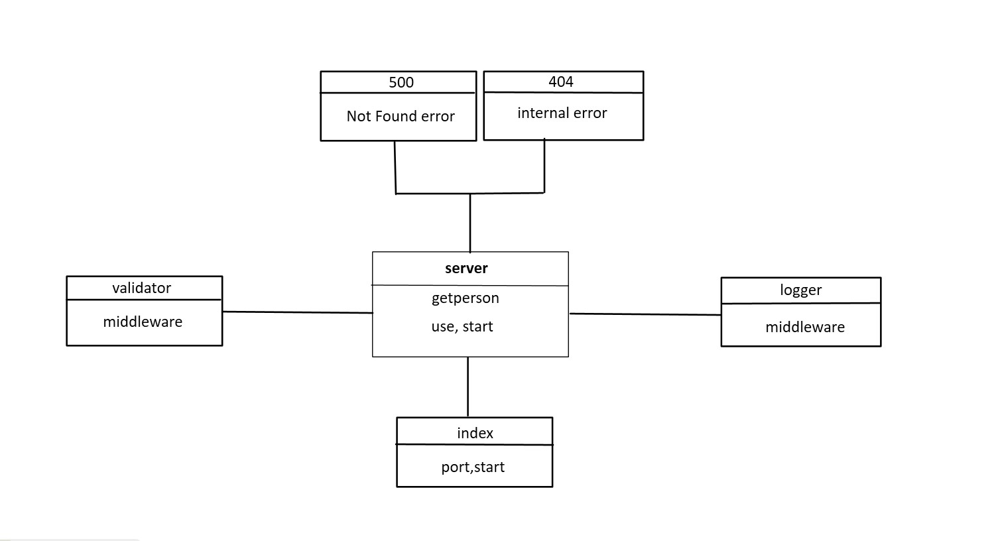

# basic-express-server

## deployed:

https://basic-express-server-me.herokuapp.com/

## port =3000

## run application : npm start ,nodemon

## run  unit test : npm test  Lint Tests: npm run lint

